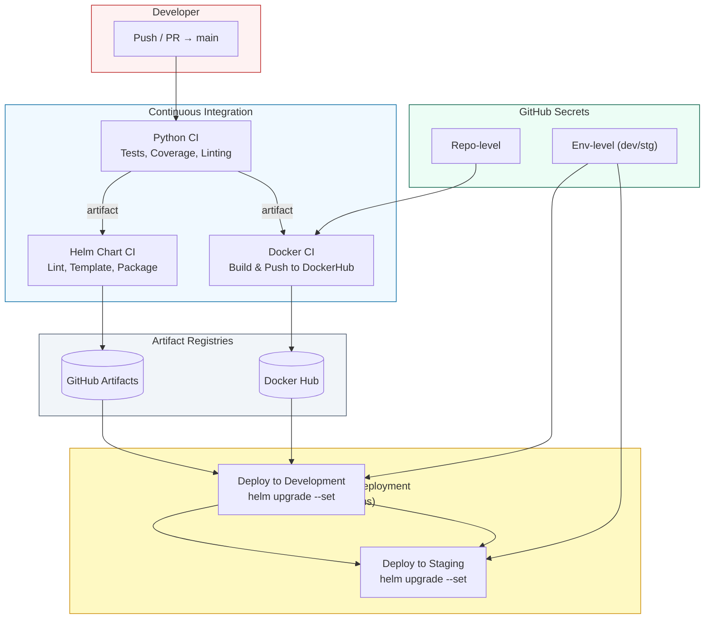

# TodoApp — Production-like CI/CD & Kubernetes Deployment

**Short description**  
TodoApp — production-like task management API (Django) with a complete DevOps workflow: containerization (Docker), CI/CD (GitHub Actions reusable workflows), Helm charts, and deployment to Azure AKS. Demonstrates secrets management, environment separation (development, staging), and Helm-based deployment.

---

## Key highlights / stack
- **Deploy target:** Azure AKS (development & staging)  
- **Container registry:** Docker Hub (images pushed from GitHub Actions)  
- **Database:** MySQL (in-cluster or external — secrets managed via GitHub Secrets)  
- **Infrastructure as code:** Helm charts (`helm-charts/todoapp`) + Kubernetes manifests  
- **CI/CD:** GitHub Actions with reusable workflows (build/test/push/deploy)  
- **Environments:** `development` and `staging` (separate namespaces & values files)  
- **Secrets:** Repo-level and environment-level secrets, injected into workflows  

---

## Repository structure (high-level)
```
.
├── .github/workflows     # CI/CD reusable workflows
├── bootstrap.sh          # local / bootstrap helpers
├── cluster.yml           # cluster manifest / documentation
├── helm-charts/todoapp   # Helm chart for the application
├── src/                  # Django application
│   ├── Dockerfile
│   ├── requirements.txt
│   └── ...
└── README.md
```

---

## How it works (high-level)
1. Developer pushes to `main` branch.  
2. **CI pipeline** runs:
   - Python linting and unit tests (`pytest`)  
   - Test coverage reporting  
   - Helm chart linting, templating, packaging  
   - Docker image build and push to Docker Hub  
3. **CD pipeline** deploys to AKS via Helm using environment-specific values:
   - `helm upgrade --install` for development and staging  
   - Secrets injected from GitHub Secrets (env-level)  

---

## Environments

| Environment  | Namespace             | Secrets location           |
|-------------|---------------------|----------------------------|
| development | `todoapp`           | GitHub environment secrets |
| staging     | `todoapp-staging`   | GitHub environment secrets |

> CI injects secrets from GitHub environment into workflows at deploy time.

---

## Secrets (high-level)
**Repository secrets** (repo-level):  
- `DOCKERHUB_USERNAME`  
- `DOCKERHUB_TOKEN`  

**Environment secrets** (dev/staging):  
- `AZURE_CREDENTIALS`  
- `DB_HOST`  
- `DB_NAME`  
- `DB_USER`  
- `DB_PASSWORD`  
- `MYSQL_USER`  
- `MYSQL_PASSWORD`  
- `MYSQL_ROOT_PASSWORD`  
- `TODOAPP_SECRET_KEY`  

> Secrets are **never committed**. CI/CD injects them into Helm via `--set` (or `kubectl create secret`) as part of the workflow.  
> For full reference see `docs/secrets.md`.

---

## CI/CD overview

### Workflow stages
1. **lint & test** — Python linters + pytest unit tests  
2. **build** — Docker image build  
3. **push** — Login to Docker Hub and push image  
4. **deploy** — Helm upgrade/install to AKS using environment-specific values and secrets  

> Full workflow files are in `.github/workflows/` or see `docs/ci-cd.md`.

---

## Architecture diagram (Mermaid)


---


## Next steps / improvements
- Use managed database (Azure Database for MySQL) for production readiness  
- Move secrets to Azure Key Vault / external secrets for prod  
- Add E2E tests, blue-green or canary deployments  
- Integrate observability: Prometheus/Grafana, Azure Monitor dashboards, centralized logging  

---

## Contacts / Author
Project prepared as **portfolio DevOps case**, demonstrating CI/CD, Helm-based deployments, Azure AKS integration, and best practices for secrets management.
